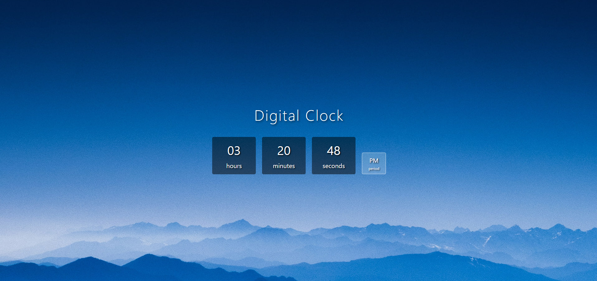

# Digital Clock

A real-time digital clock application. With modern design and seamless performance, it displays the time in 12-hour AM/PM format.

## 📸 Project Screenshot



## 🎯 Features

- ⏰ Real-time clock update (every second)
- 🕐 12-hour AM/PM format
- 🎨 Modern and elegant interface
- 📱 Responsive design
- 🌙 Aesthetic appearance with background image
- 📦 Time, minutes, seconds, and period indicator in boxes

## 📋 File Structure

```
Digital Clock/
├── index.html      # HTML structure
├── style.css       # Styling file
├── script.js       # JavaScript functionality
├── Readme.md       # This file
└── img/
    └── background.jpg  # Background image
```

## 🛠️ Technologies Used

- **HTML5** - Page structure
- **CSS3** - Styling and design (Flexbox)
- **JavaScript** - Dynamic clock functionality

## 🚀 How to Use?

1. Download the files to your computer
2. Open `index.html` in your web browser
3. Watch the real-time clock update

## 💻 Code Features

### JavaScript (script.js)
- `updateClock()` function runs every second
- Converts time to 12-hour format
- Automatically sets AM/PM value
- Adds leading zeros to numbers less than 10 (01, 02, etc.)

### CSS (style.css)
- Responsive layout with **Flexbox**
- Transparent boxes with **RGBA colors**
- Depth effect with **Text-shadow**
- Different sized boxes (clock: 90x90px, AM/PM: 50x50px)

## 🎨 Design Details

- **Main Boxes**: 90x90 pixels, dark background (rgba(0, 0, 0, 0.5))
- **AM/PM Box**: 50x50 pixels, light background (rgba(255, 255, 255, 0.2))
- **Border Radius**: 5px (sharp corners)
- **Font Family**: Segoe UI, Tahoma, Geneva, Verdana, sans-serif

## 📝 License

This project is freely available for use and modification.

## 👨‍💻 Developer

Created: 2024
